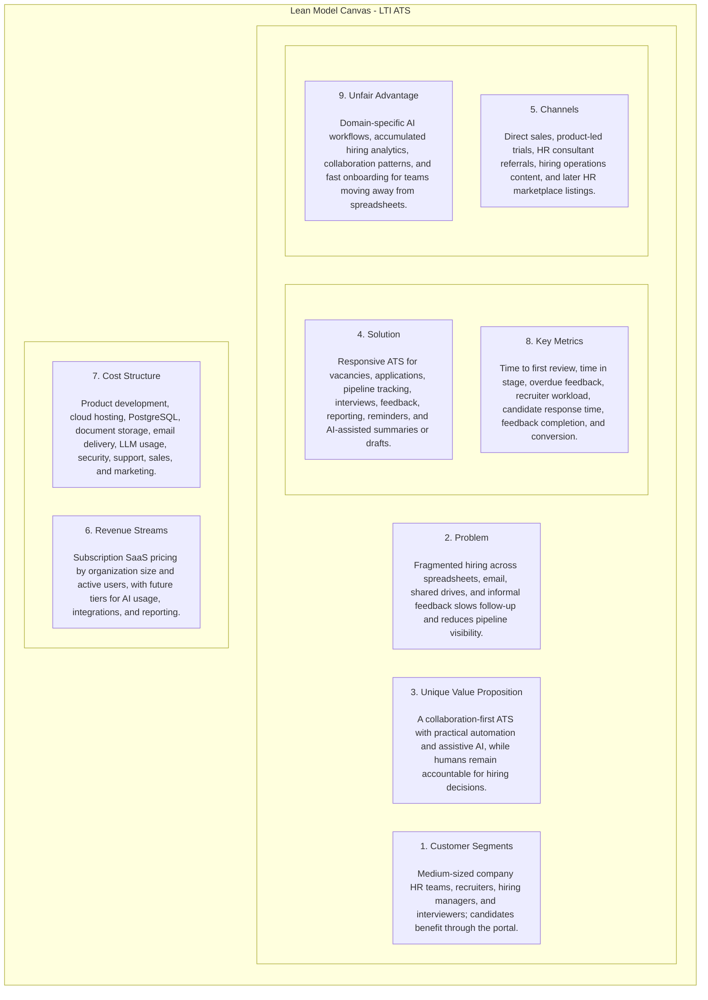
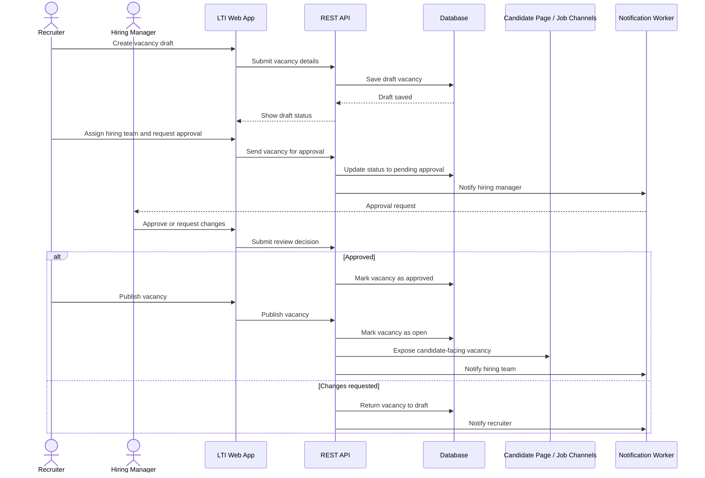
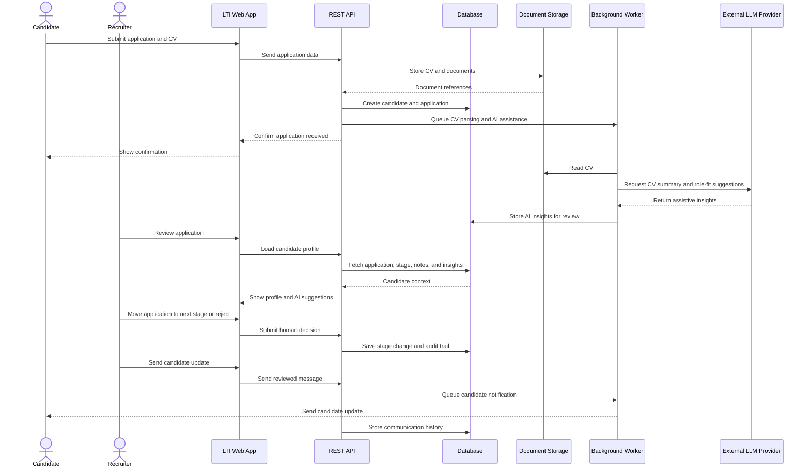
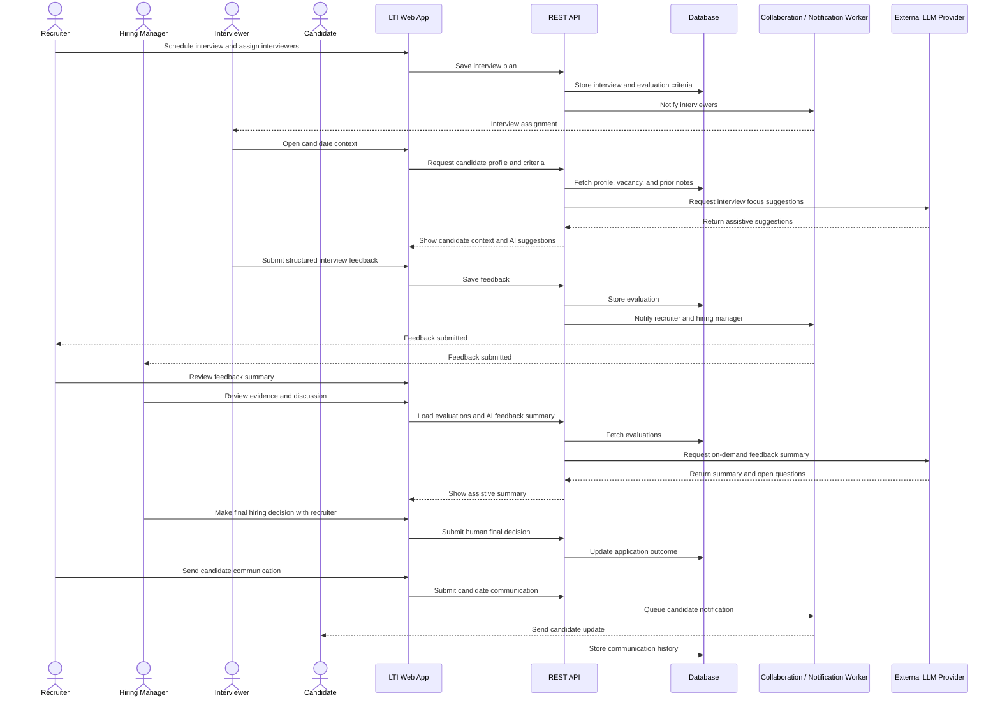
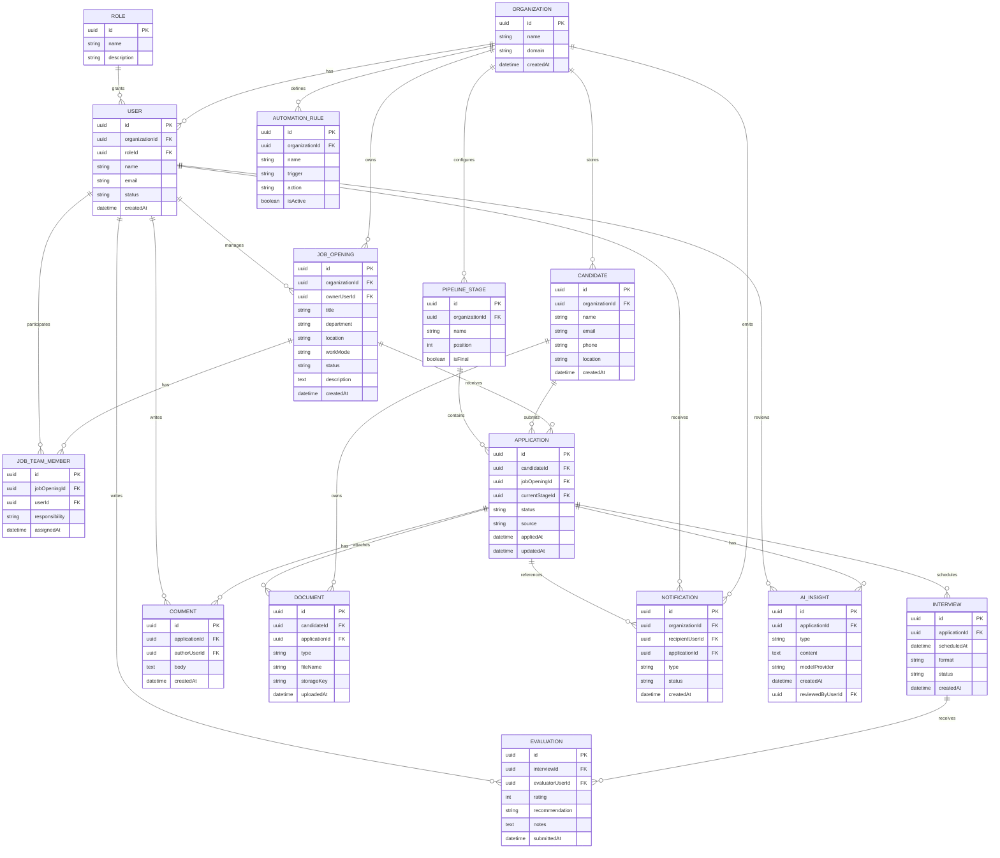
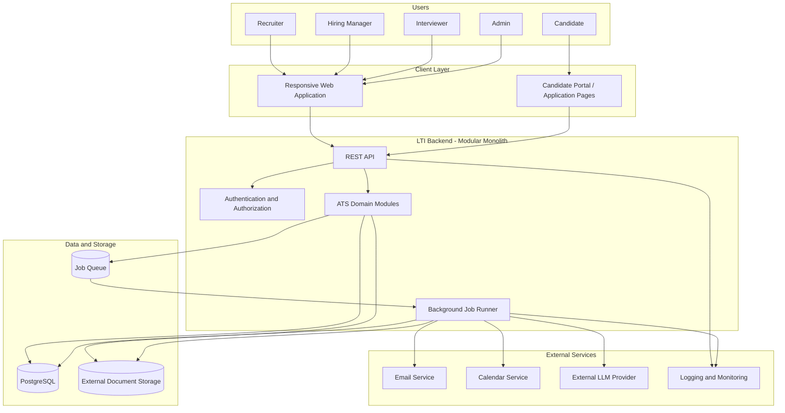
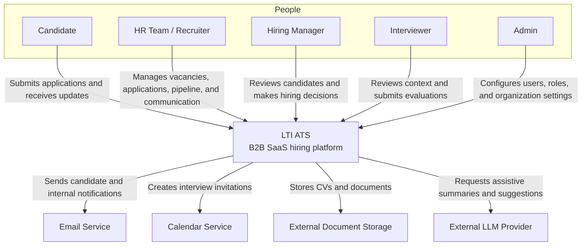
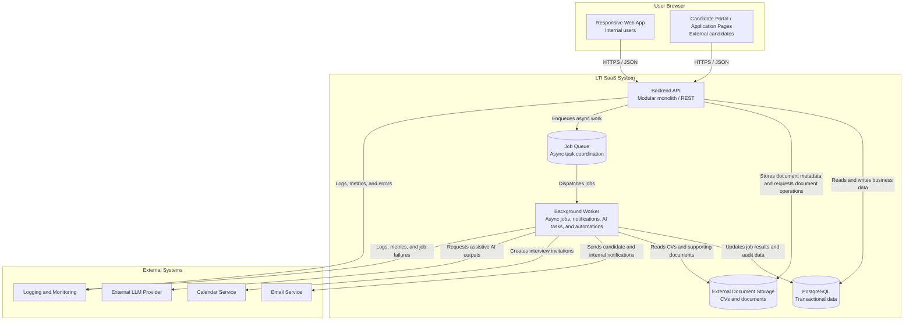

# LTI - Modern ATS for Collaborative Hiring

## 1. Brief Description

LTI is a B2B SaaS Applicant Tracking System (ATS) for medium-sized companies that need a structured, collaborative, and efficient hiring process without the complexity of an enterprise recruiting suite.

The product helps HR teams and recruiters manage job vacancies, applications, candidate communication, interview coordination, evaluations, and hiring pipeline visibility from a single responsive web application. Hiring managers and interviewers participate directly in the process by reviewing candidate profiles, leaving feedback, and collaborating on hiring decisions.

LTI includes assistive AI capabilities for operational recruiting work: CV summaries, candidate-to-role match suggestions, interview preparation notes, candidate insights, and draft messages. AI is treated as a support tool only. It does not approve, reject, rank automatically as a final decision, or replace human judgment in hiring.

## 2. Added Value and Competitive Advantages

LTI focuses on reducing the daily friction that slows down hiring teams in growing companies:

- Faster recruiter workflows: recruiters can centralize vacancies, applications, candidate profiles, notes, documents, and next actions instead of coordinating across spreadsheets, email threads, and disconnected tools.
- Better collaboration with hiring managers: managers can review candidates, comment, and give structured feedback in the same system recruiters use, reducing decision delays and missing context.
- Clear interview participation: interviewers receive the relevant candidate context, evaluation criteria, and feedback forms, making interviews easier to prepare and compare.
- Improved candidate experience: candidates benefit from clearer communication, faster responses, and a more consistent process across application, interview, and follow-up stages.
- Practical automation: reminders, status updates, task assignments, and notification flows reduce manual follow-up without requiring a complex enterprise workflow engine.
- Assistive AI for repetitive work: LTI helps summarize CVs, draft candidate messages, surface role-fit signals, and prepare interview notes, while keeping final hiring decisions with accountable users.
- MVP-friendly implementation: the first version prioritizes the core hiring lifecycle and avoids enterprise-scale modules such as advanced workforce planning, complex multi-brand career sites, custom BI platforms, or deep HRIS/payroll suites.

## 3. Main Product Features

The MVP should include the following product capabilities:

- Job vacancy management: create, edit, approve, publish, pause, and close job vacancies with role details, location, work mode, salary range, hiring team, and required skills.
- Application intake: capture candidate applications through a simple candidate-facing flow, including personal data, CV upload, links, consent, and answers to screening questions.
- Candidate profile: maintain a unified view of each candidate with contact details, documents, application history, notes, AI-generated summaries, communication history, and current pipeline stage.
- Recruitment pipeline: track applications through configurable MVP stages such as Applied, Screening, Interview, Final Review, Offer, Hired, and Rejected.
- Collaboration tools: allow recruiters, hiring managers, and interviewers to comment, mention teammates, assign follow-up tasks, and record decisions in context.
- Interview coordination: schedule interviews, assign interviewers, define evaluation criteria, and collect structured feedback after each interview.
- Candidate communication: draft, send, and track basic email notifications for application received, interview invitation, status update, rejection, and offer follow-up.
- Assistive AI features: generate CV summaries, suggest possible role-fit signals, draft candidate messages, propose interview focus areas, and summarize interview feedback for review.
- Human decision controls: require recruiters or hiring managers to make final stage changes, rejection decisions, offer decisions, and hiring decisions. AI outputs must be visible as suggestions, not automated outcomes.
- Role-based access control: support internal workspace roles for Admin, Recruiter, Hiring Manager, and Interviewer. Candidate is an external persona with limited candidate portal permissions for applying and receiving process updates.
- Basic reporting: provide simple operational metrics such as open vacancies, candidates by stage, time in stage, pending feedback, and hiring pipeline health.

## 4. Lean Canvas

| Block | LTI MVP Definition |
| --- | --- |
| Problem | Medium-sized companies often manage hiring with fragmented tools: spreadsheets, email threads, shared drives, calendar invites, and informal feedback. This creates slow follow-up, duplicated work, unclear ownership, inconsistent candidate communication, and limited visibility into pipeline health. |
| Customer Segments | HR teams, recruiters, hiring managers, and interviewers in medium-sized companies that hire regularly but do not need a complex enterprise ATS. Candidates are indirect users who benefit from a clearer and faster hiring experience through the candidate portal. |
| Unique Value Proposition | A collaboration-first ATS that helps hiring teams move candidates through the pipeline faster by combining structured workflows, practical automation, and assistive AI, while keeping humans accountable for hiring decisions. |
| Solution | A responsive ATS for vacancy management, candidate applications, pipeline tracking, interview coordination, structured feedback, basic reporting, automated reminders, and AI-assisted summaries, message drafts, and interview preparation. |
| Channels | Direct sales to HR leaders and operations managers, product-led trials for recruiting teams, referrals from HR consultants, content focused on hiring operations, and integrations or listings in HR software marketplaces after MVP validation. |
| Revenue Streams | Subscription-based SaaS pricing by organization size and active users, with a base plan for core ATS workflows and higher tiers later for advanced automation, AI usage packages, integrations, and reporting. |
| Cost Structure | Product development, cloud hosting, PostgreSQL, document storage, email delivery, external LLM provider usage, security and compliance work, customer support, onboarding, sales, and marketing. |
| Key Metrics | Time to first candidate review, time in pipeline stage, number of overdue feedback requests, recruiter workload per vacancy, candidate response time, interview feedback completion rate, active vacancies, and trial-to-paid conversion. |
| Unfair Advantage | Domain-specific AI workflows for hiring operations, accumulated hiring analytics, real-time collaboration patterns, fast onboarding for teams moving away from spreadsheets, and transparent assistive AI designed around human accountability. |

## 5. Main Use Cases

The following use cases describe the main user goals of the LTI ATS. Each use case includes a sequence diagram showing the interaction between users and system components.

### 5.1 Create and publish a job vacancy

**Primary actors:** Recruiter, Hiring Manager.

**Supporting actors:** Admin, Interviewer, Candidate.

**Preconditions:**

- The recruiter is authenticated and has permission to create vacancies.
- The hiring manager exists in the organization and can be assigned to the hiring team.
- Basic company, department, and role information is available.

**Main flow:**

1. The recruiter creates a new vacancy with title, department, location, work mode, seniority, salary range, role description, required skills, and hiring team.
2. The recruiter assigns the hiring manager and optional interviewers.
3. The hiring manager reviews the vacancy details and requests changes or approves publication.
4. The recruiter applies the approved changes and publishes the vacancy.
5. LTI makes the vacancy available through the candidate-facing application page and records the vacancy as open.
6. The system notifies the hiring team that the vacancy is live.

**Alternate/error flow:**

- If mandatory fields are missing, LTI keeps the vacancy as draft and shows validation errors.
- If the hiring manager requests changes, the vacancy returns to draft until the recruiter updates it.
- If publishing fails, the vacancy remains approved but unpublished, and the recruiter can retry.

**Business value:**

This use case gives recruiters and hiring managers a shared, structured starting point for each hiring process. It reduces unclear requirements, prevents premature publication, and creates a single source of truth for the role before candidates start applying.

**Diagram:**

### 5.2 Manage applications in the recruitment pipeline

**Primary actors:** Recruiter, Candidate.

**Supporting actors:** Hiring Manager, Background Worker, External LLM Provider.

**Preconditions:**

- A job vacancy is published and open for applications.
- The candidate can access the application form.
- The recruiter has permission to manage applications for the vacancy.

**Main flow:**

1. The candidate submits an application with contact details, CV, links, consent, and screening answers.
2. LTI stores the application and attaches the CV or supporting documents to the candidate profile.
3. A background task extracts basic CV information and requests an AI-assisted summary and role-fit suggestions.
4. The recruiter reviews the candidate profile, application details, AI summary, and screening answers.
5. The recruiter moves the application through the pipeline stages, such as Applied, Screening, Interview, Final Review, Offer, Hired, or Rejected.
6. LTI records stage changes, comments, pending actions, and candidate communication history.
7. The recruiter sends status updates or next-step messages to the candidate.

**Alternate/error flow:**

- If CV parsing or AI processing fails, the application remains available and the recruiter can review the original documents manually.
- If required candidate consent is missing, LTI blocks submission or flags the application for correction.
- If the candidate is not a fit, the recruiter can reject the application with a human-authored or AI-drafted message reviewed before sending.

**Business value:**

This use case helps recruiters process applications consistently and faster without losing human control. Candidates receive clearer communication, while hiring teams gain better visibility into where each application stands and what actions are pending.

**Diagram:**

### 5.3 Evaluate candidates collaboratively with AI assistance

**Primary actors:** Recruiter, Hiring Manager, Interviewer.

**Supporting actors:** Candidate, External LLM Provider, Background Worker.

**Preconditions:**

- The candidate has reached an interview or final review stage.
- Interviewers are assigned and have access to the relevant candidate profile.
- Evaluation criteria are defined for the vacancy.

**Main flow:**

1. The recruiter schedules an interview and assigns one or more interviewers.
2. LTI gives interviewers access to the candidate profile, CV summary, role requirements, and evaluation criteria.
3. AI assists by suggesting interview focus areas based on the vacancy and candidate profile.
4. Interviewers complete structured feedback after the interview, including ratings, notes, risks, and recommendation.
5. LTI collects feedback and makes it visible to the recruiter and hiring manager.
6. AI may summarize feedback themes and highlight open questions, but does not decide the outcome.
7. The hiring manager and recruiter review the evidence, discuss the candidate, and make the final decision.
8. The recruiter updates the application stage and sends the appropriate candidate communication.

**Alternate/error flow:**

- If an interviewer does not submit feedback, LTI sends reminders and marks the evaluation as pending.
- If feedback is contradictory, the recruiter can request an additional interview or manager review.
- If AI-generated notes are incomplete or inaccurate, users rely on the original CV, interview notes, and human feedback.

**Business value:**

This use case improves decision quality by keeping interview feedback structured, visible, and comparable. It reduces delays caused by missing feedback while preserving the ethical constraint that AI supports the process but humans make the final hiring decision.

**Diagram:**

## 6. Data Model

The MVP data model focuses on the core hiring workflow: companies configure users and roles, recruiters create vacancies, hiring teams collaborate on job openings, candidates submit applications, recruiters manage pipeline stages, interviewers provide evaluations, and the system stores documents, comments, notifications, automations, and AI-generated assistance.

| Entity | Main attributes and types | Purpose |
| --- | --- | --- |
| Organization | id: uuid, name: string, domain: string, createdAt: datetime | Tenant/company using LTI. |
| User | id: uuid, organizationId: uuid, roleId: uuid, name: string, email: string, status: string, createdAt: datetime | Internal user such as Admin, Recruiter, Hiring Manager, or Interviewer. |
| Role | id: uuid, name: string, description: string | Access control role for internal users. For the MVP, roles are global and reused across organizations. |
| JobOpening | id: uuid, organizationId: uuid, ownerUserId: uuid, title: string, department: string, location: string, workMode: string, status: string, description: text, createdAt: datetime | Vacancy managed by the hiring team. |
| JobTeamMember | id: uuid, jobOpeningId: uuid, userId: uuid, responsibility: string, assignedAt: datetime | User assigned to a vacancy with a specific responsibility, such as recruiter, hiring manager, or interviewer. |
| Candidate | id: uuid, organizationId: uuid, name: string, email: string, phone: string, location: string, createdAt: datetime | Person applying to one or more vacancies. |
| Application | id: uuid, candidateId: uuid, jobOpeningId: uuid, currentStageId: uuid, status: string, source: string, appliedAt: datetime, updatedAt: datetime | Candidate's application to a specific vacancy. |
| PipelineStage | id: uuid, organizationId: uuid, name: string, position: int, isFinal: boolean | Configurable recruitment stage. |
| Interview | id: uuid, applicationId: uuid, scheduledAt: datetime, format: string, status: string, createdAt: datetime | Interview planned for an application. |
| Evaluation | id: uuid, interviewId: uuid, evaluatorUserId: uuid, rating: int, recommendation: string, notes: text, submittedAt: datetime | Structured feedback from interviewers or hiring managers. |
| Comment | id: uuid, applicationId: uuid, authorUserId: uuid, body: text, createdAt: datetime | Collaboration note in the candidate/application context. |
| Document | id: uuid, candidateId: uuid, applicationId: uuid, type: string, fileName: string, storageKey: string, uploadedAt: datetime | CVs and supporting candidate documents stored externally. The backend uses the storage key to generate secure access URLs when needed. |
| AutomationRule | id: uuid, organizationId: uuid, name: string, trigger: string, action: string, isActive: boolean | MVP automation for reminders and notifications. |
| Notification | id: uuid, organizationId: uuid, recipientUserId: uuid, applicationId: uuid, type: string, status: string, createdAt: datetime | Internal notification or reminder. |
| AIInsight | id: uuid, applicationId: uuid, type: string, content: text, modelProvider: string, createdAt: datetime, reviewedByUserId: uuid | Assistive AI output such as CV summary, match suggestion, interview preparation, or feedback summary. |

Key data rules:

- A candidate can apply to multiple job openings.
- A job opening can receive many applications.
- A candidate should not have more than one active application for the same job opening.
- Each application belongs to one current pipeline stage.
- AI insights are assistive artifacts and should be reviewed by a human user before being used in hiring decisions.
- Candidate documents are stored outside the relational database; the database only stores metadata and secure storage references.

## 7. High-Level System Design

LTI should be designed as a modular monolith for the MVP. This keeps deployment, operations, and development simple while still separating the main business capabilities into clear internal domain modules. The system can later extract modules into separate services only if product traction and scale justify the added complexity.

The user-facing product has two client experiences. Internal users such as HR teams, recruiters, hiring managers, interviewers, and administrators use a responsive web application. Candidates use a limited candidate portal or application pages to submit applications and view or respond to basic process updates. Internal users authenticate with login credentials and role-based permissions, while candidate access is restricted to candidate-facing workflows.

The backend exposes a REST API and owns the core business rules for vacancies, applications, pipeline stages, interviews, evaluations, comments, documents, notifications, automation rules, and AI insights. The API validates authentication and authorization on every operation so, for example, interviewers only access assigned candidate context and candidates cannot access internal evaluation data.

PostgreSQL is the primary database for transactional data: organizations, users, roles, vacancies, hiring team assignments, candidates, applications, pipeline stages, interviews, evaluations, comments, notifications, automation rules, and AI insight metadata. CVs and supporting documents are stored in external document storage, while the database stores document metadata and secure storage references.

Background jobs handle work that should not block the user interface: CV parsing, AI summarization, AI-assisted match suggestions, notification delivery, interview reminders, pending feedback reminders, and automation execution. The REST API stores the required data and enqueues asynchronous tasks; the background job runner processes the queue and interacts with slower or external services when needed. This keeps recruiter and candidate workflows responsive even when external services are slow.

Most AI tasks are executed asynchronously by background jobs. For interactive user flows, the REST API may request lightweight on-demand AI assistance, such as interview focus suggestions or feedback summaries, while still storing the output as a reviewable suggestion.

AI capabilities are integrated through an external LLM provider. LTI sends only the data needed for a specific assistive task, such as summarizing a CV, drafting a candidate message, suggesting interview focus areas, or summarizing interview feedback. AI outputs are stored as reviewable suggestions and must remain visibly separate from human decisions. Final hiring decisions, rejection decisions, offer decisions, and stage changes are made by authorized users.

The MVP should include simple integrations rather than a broad enterprise integration suite. Email delivery is needed for candidate communication and internal notifications. Calendar integration may be limited to storing interview schedule data or sending calendar-compatible invitations. Job board integrations can start as candidate-facing vacancy pages or manual sharing links, with automated external posting deferred until the product validates demand.

Operationally, the system should include basic auditability and observability: timestamps for key records, user attribution for decisions and comments, logs for failed background jobs, and simple health/error monitoring. The REST API and background job runner both send logs and metrics to the monitoring layer. This is enough for MVP reliability without overbuilding enterprise governance workflows.

Key design trade-offs:

- Modular monolith over microservices: faster to build and easier to operate for an MVP.
- REST API over complex event-driven APIs: simpler for a responsive web application and common CRUD-heavy ATS workflows.
- Background jobs over synchronous external calls: keeps user workflows responsive and isolates slow or unreliable integrations.
- External document storage over database file storage: better suited for CVs and attachments.
- External LLM provider over custom AI models: faster to validate assistive AI features.
- Human-in-the-loop AI over automated decision-making: protects fairness, accountability, and user trust.

## 8. High-Level Architecture Diagram

## 9. C4 Component Diagram - Backend API / Modular Monolith

This C4 deep dive focuses on the Backend API / Modular Monolith. The context and container summaries show how the backend fits into the broader LTI SaaS system, while the component-level diagram goes deeper into the internal backend modules that implement the MVP ATS capabilities.

For GitHub-compatible rendering, the diagrams are written using Mermaid flowcharts while following the C4 structure: context, containers, and backend components.

### 9.1 Context Level

At context level, LTI is the central SaaS product used by external candidates and internal hiring stakeholders. It integrates with email, calendar, document storage, and an external LLM provider.

### 9.2 Container Level

At container level, the responsive web app and candidate application pages call the REST API. The Backend API remains a modular monolith for the MVP, supported by PostgreSQL, external document storage, a job queue, and a background worker for asynchronous work.

### 9.3 Component Level: Backend API / Modular Monolith

At component level, the Backend API / Modular Monolith is split into cohesive modules. The modules share a persistence adapter for PostgreSQL and use dedicated adapters for persistence, document storage, job queueing, calendar operations, AI assistance, notification delivery, and monitoring. Notification delivery is triggered through queued background jobs rather than direct email calls from the API. External operations that may be slow or unreliable are enqueued for asynchronous processing by the background worker.

```mermaid
flowchart TB
    subgraph Api["Backend API / Modular Monolith"]
        ApiGateway["REST Controllers\nRequest validation and routing"]
        AuthModule["Authentication and Authorization"]
        OrgModule["Organization and User Module"]
        JobModule["Job Management Module"]
        CandidateModule["Candidate Management Module"]
        PipelineModule["Pipeline Management Module"]
        InterviewModule["Interview Management Module"]
        CollaborationModule["Collaboration Module"]
        DocumentModule["Document Management Module"]
        AutomationModule["Automation Module"]
        AiModule["AI Assistance Module"]
        ReportingModule["Basic Reporting Module"]

        PersistenceAdapter["Persistence Adapter\nPostgreSQL repositories"]
        DocumentAdapter["Document Storage Adapter"]
        QueueAdapter["Job Queue Adapter"]
        NotificationAdapter["Notification / Email Adapter"]
        CalendarAdapter["Calendar Adapter"]
        AiAdapter["LLM Adapter"]
        MonitoringAdapter["Monitoring Adapter"]
    end

    Db[("PostgreSQL")]
    Storage[("External Document Storage")]
    Queue[("Job Queue")]
    Email["Email Service"]
    Calendar["Calendar Service"]
    LLM["External LLM Provider"]
    Monitoring["Logging and Monitoring"]

    ApiGateway --> AuthModule
    ApiGateway --> OrgModule
    ApiGateway --> JobModule
    ApiGateway --> CandidateModule
    ApiGateway --> PipelineModule
    ApiGateway --> InterviewModule
    ApiGateway --> CollaborationModule
    ApiGateway --> DocumentModule
    ApiGateway --> AutomationModule
    ApiGateway --> AiModule
    ApiGateway --> ReportingModule

    OrgModule --> PersistenceAdapter
    JobModule --> PersistenceAdapter
    CandidateModule --> PersistenceAdapter
    PipelineModule --> PersistenceAdapter
    InterviewModule --> PersistenceAdapter
    CollaborationModule --> PersistenceAdapter
    DocumentModule --> PersistenceAdapter
    AutomationModule --> PersistenceAdapter
    AiModule --> PersistenceAdapter
    ReportingModule --> PersistenceAdapter

    DocumentModule --> DocumentAdapter
    DocumentModule --> QueueAdapter

    AutomationModule --> QueueAdapter
    InterviewModule --> QueueAdapter
    CollaborationModule --> QueueAdapter
    AiModule --> QueueAdapter

    AutomationModule --> NotificationAdapter
    CollaborationModule --> NotificationAdapter
    InterviewModule --> CalendarAdapter
    AiModule --> AiAdapter

    PersistenceAdapter --> Db
    DocumentAdapter --> Storage
    QueueAdapter --> Queue
    NotificationAdapter --> Email
    CalendarAdapter --> Calendar
    AiAdapter --> LLM
    MonitoringAdapter --> Monitoring

    ApiGateway --> MonitoringAdapter
```

## 10. Key MVP Assumptions and Constraints

- LTI is designed for medium-sized companies and HR teams, not for large enterprise recruiting programs with complex multi-region, multi-brand, or highly customized governance needs.
- The MVP uses a modular monolith because the product still needs fast iteration and simple operations. Microservices are intentionally deferred.
- The internal RBAC workspace roles are Admin, Recruiter, Hiring Manager, and Interviewer. Candidate is an external persona/user with limited candidate portal permissions for submitting applications, uploading documents, and receiving or responding to process updates.
- Recruiters own day-to-day pipeline operations, while hiring managers participate in vacancy approval, candidate review, and final hiring decisions.
- Interviewers only need access to assigned candidate context, interview details, and evaluation forms.
- AI is assistive only. It can summarize, suggest, draft, and highlight signals, but it cannot make final hiring, rejection, offer, or ranking decisions.
- CVs and supporting documents are stored in external object storage. PostgreSQL stores structured business data and document references.
- Background jobs are used for non-blocking work such as CV parsing, AI tasks, reminders, notifications, and automation execution.
- Initial integrations stay lightweight: email notifications, basic calendar support, external document storage, and an external LLM provider. Advanced job board, HRIS, payroll, SSO, and analytics integrations are outside MVP scope.
- Basic auditability is required for important human decisions, stage changes, comments, evaluations, and AI insight review.

## 11. Final Validation Checklist

- The main document covers the requested deliverables: product description, added value, competitive advantages, main features, Lean Canvas, three main use cases, data model, high-level system design, architecture diagram, and C4 component deep dive.
- All diagrams are embedded directly in Markdown using Mermaid blocks.
- The design remains focused on a practical MVP for a B2B SaaS ATS.
- The deliverable is documentation only and does not include application source code.
